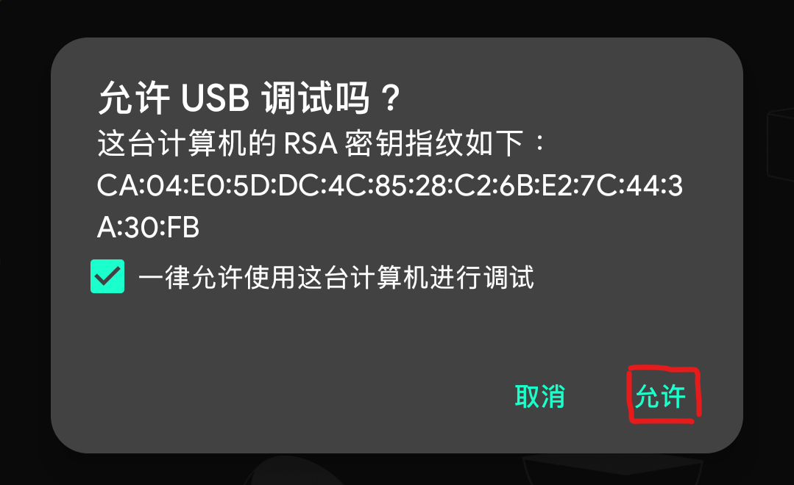
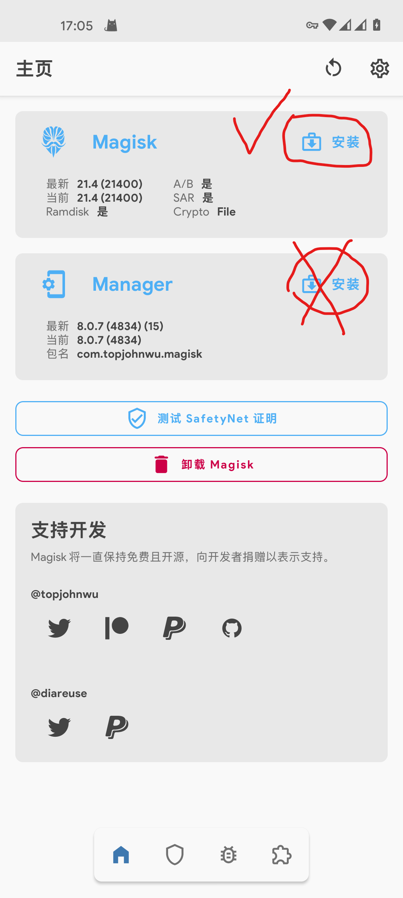
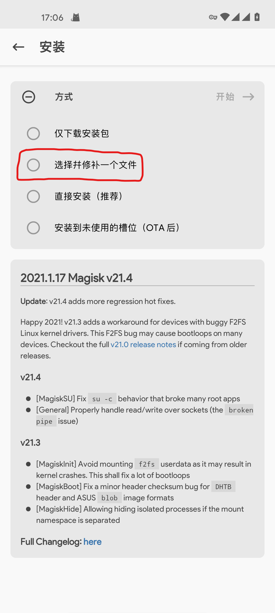
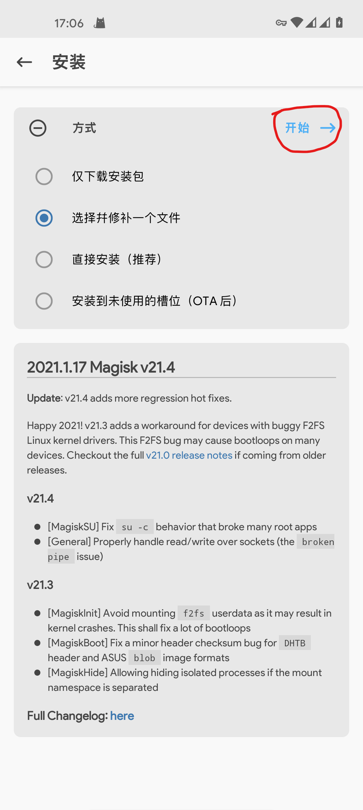
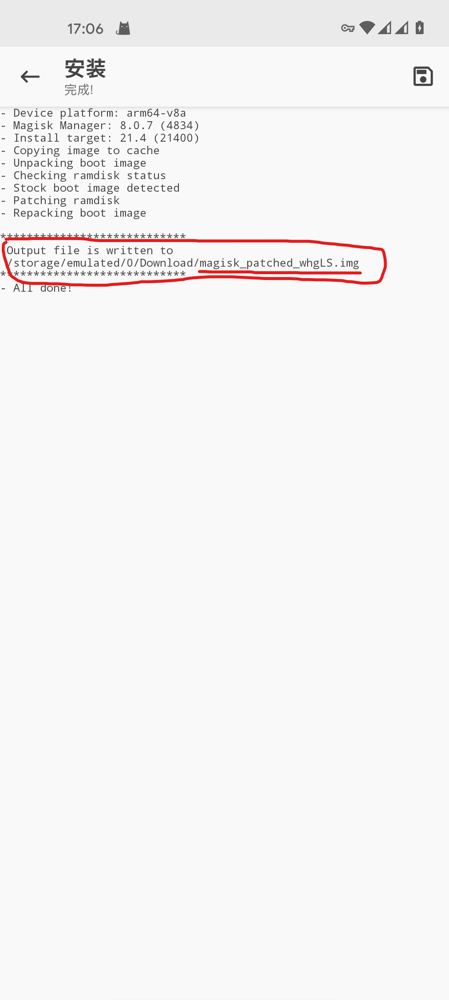
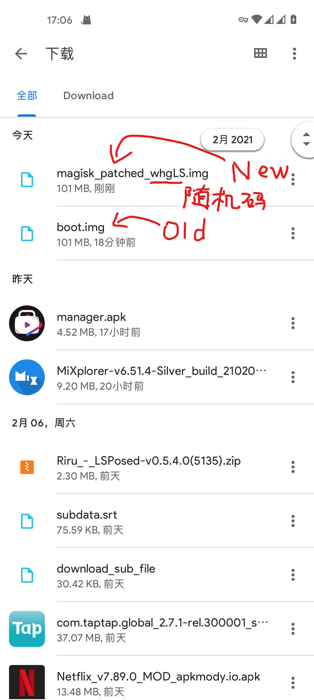
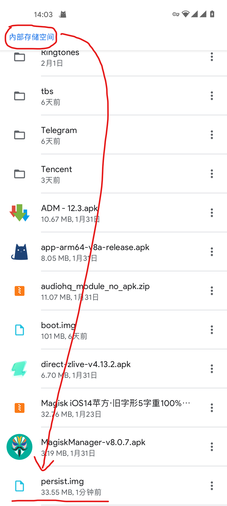

# OnePlus-flash-tutorial

## 大纲

[注意事项](#注意事项)

[事前准备](#事前准备)

[一，解锁 Bootloader](#Unlock-BL)

- [搭建 adb 工具](#搭建-adb-工具)
- [使用解锁命令解锁](#使用解锁命令解锁)

[二，打包 Boot，使用 MagiskRoot](#MagiskRoot)

- [提取 Boot](#提取-Boot)
- [使用 Magisk Patch Boot](#使用-Magisk-Patch-Boot)
- [刷入已打包的 Boot](#刷入已打包的-Boot)

[备份指纹分区](#Backup-Persist)

[刷入自定义 ROM](#CustomRom)

## 注意事项

- 此教程暂只支持 **一加 8** 刷入 **Havoc OS** ，后续（可能）会支持更多机型或 ROM，非 **一加 8** 刷入 **Havoc OS** 的请勿轻易使用本教程尝试！！！

- 手机变砖不要慌， ~~拿出手机拍个朋友圈儿\~\~~~ ，搞机有风险，刷机需谨慎。

## 事前准备

1. 一台电脑（其实一台已 root 的手机也行，后面有空补上）；
2. 一加 8 手机；
3. 手，当然你用脚也行。

## 一，解锁 Bootloader

\* 此阶段可选，若已经解锁 Bootloader 则可跳过此步，到
[**第二步：打包 Boot，使用 MagiskRoot**](#MagiskRoot) 。已解锁 Bootloader 的明显特征是手机在开机时会有设备已解锁的提示。

- **注意：解锁 Bootloader 会清除所有数据！包括图片，音乐，应用等等（不包括系统）**
- **注意：解锁 Bootloader 会清除所有数据！包括图片，音乐，应用等等（不包括系统）**
- **注意：解锁 Bootloader 会清除所有数据！包括图片，音乐，应用等等（不包括系统）**

解锁 Bootloader 是怎么回事呢？解锁 Bootloader 相信大家都很熟悉，但是解锁 Bootloader 是怎么回事呢，下面就让小编带大家一起了解吧。

解锁 Bootloader，其实就是用 **adb 工具** 解锁 Bootloader，大家可能会很惊讶 **adb 工具** 怎么解锁 Bootloader 呢？但事实就是这样，小编也感到非常惊讶。

这就是关于解锁 Bootloader 的事情了，大家有什么想法呢，欢迎在评论区告诉小编一起讨论哦！

咳咳，回到正题，下面是谷歌官方对 Bootloader 的介绍：

> **引导加载程序**
>
> 引导加载程序是供应商专有的映像，负责在设备上启动内核。它会监护设备状态，负责初始化 [可信执行环境 (TEE)](https://source.android.com/security/trusty) 以及绑定其信任根。
>
> 引导加载程序由许多部分组成，包括启动画面。要开始启动，引导加载程序可能会直接将一个新映像刷写到相应的分区中，也可能会使用 `recovery` 开始重新刷写过程，该过程与 OTA 的操作过程一致。一些设备制造商会创建多部分引导加载程序，然后将它们组合到一个 bootloader.img 文件中。在刷写时，引导加载程序会提取各个引导加载程序并刷写所有这些引导加载程序。
>
> 最重要的是，引导加载程序会在将执行工作移到内核之前先验证 boot 分区和 recovery 分区的完整性，并显示[启动状态](https://source.android.com/security/verifiedboot/verified-boot#boot_state)部分中指定的警告。
>
> [Source](https://source.android.com/devices/bootloader)

看到最后一段我们知道，引导加载程序（Bootloader）会验证 `boot` 分区和 `recovery` 分区的完整性，而 Magisk Root 就是通过修改 `Boot` 镜像来达到目的的，所以我们只要解锁了 Bootloader 就可以尽情玩耍啦！

首先，我们要打开手机上的 **OEM 解锁** 选项来允许 Bootloader 可以被解锁，步骤如下：

1. 进入设置-关于手机，连续点击版本号，直到出现 **“处于开发者模式”** 或之类的提示（可能会要求输入 PIN，即锁屏密码）；
2. 然后，进入设置-系统-开发者选项，找到 **OEM 解锁** （ 也可以直接在设置里面搜索 “OEM 解锁” ），将其打开。

那么我们要如何解锁 Bootloader 呢？其实只需要一条命令就行啦：

    fastboot oem unlock

[Source](https://source.android.com/devices/bootloader/locking_unlocking)

> 但是，我查阅谷歌官方文档却是这样说道：2014 年及其之前生产的设备使用上述命令，2015 年
> 及其之后生产的设备使用这条命令：
>
>       fastboot flashing unlock
>
> [Source](https://source.android.com/setup/build/running)
>
> 关于两者的区别，我也翻阅了许多资料，没能看出两条命令的功能的不同之处 T_T

### 搭建 adb 工具

那么，我们应该到哪里输入命令？那么这时候就要介绍一个谷歌官方的 **_Android SDK Platform-Tools_** 啦！这也是我们俗称的 **adb 工具**，里面集成了 **adb** 和 **fastboot** 命令，点击下面的任一链接即可下载：

- [官方链接](https://developer.android.com/studio/releases/platform-tools)
- [蓝奏云](https://jerrywn.lanzous.com/iA9jLlfseyh)

下载完成后解压，打开解压后的文件夹，我们会看见这些：

使用 adb 工具有多种方法，我介绍其中两种：

#### 方法一 ：配置环境变量后随地使用（建议）

这些文件可以存放在任意地方 **（路径最好不要有中文）** ，将整个文件夹剪切至任意你想要的位置之后，点击文件资源管理器的地址栏，将路径复制下来，例如我的图片上的路径就是：

    D:\Download\Compressed\platform-tools_r30.0.5-windows\platform-tools

注意路径结尾一定是 `platform-tools` ，除非你更改了解压后的文件夹名称。

然后我们需要对 **_环境变量_** 进行配置：Windows10 系统中，使用快捷键 `Windows + S` 打开搜索工具，键入 `path` 点击最佳匹配中的 **“编辑系统环境变量”** ，如下图所示：

在打开的窗口中选择 **“环境变量”** 一项，再找到下面那栏系统变量中的变量名为 **Path** 的项，如下图所示：

.png>)

双击这个 **Path** 项，在打开的窗口中点击右侧的 **新建** ，然后在输入框中粘贴刚刚复制的文件夹地址，点击确定，如下图所示：

.png>)

此时环境变量搭建完成。

使用快捷键 `Windows + R` 打开运行窗口，键入 `cmd` 回车打开 cmd 窗口，键入：

    fastboot help

回车，此时应出现 fastboot 的相关命令用法及其解释：

若出现的是形如：

    'fastboot' 不是内部或外部命令，也不是可运行的程序或批处理文件。

则应检查环境变量有没有正确配置完成。若仍无效，请尝试使用方法二 。

> 配置环境变量之后，以后只需要打开 cmd 即可使用 adb 工具，无需再次配置环境变量。缺点是如果移动了 adb 工具的文件夹，则需要重新配置。

#### 方法二 ：就地使用

在解压后的文件夹里面，按住 **Shift** 键在文件夹内空白处右键，菜单里面就会增加 **“在此处打开 PowerShell 窗口”** 一项，如下图所示：

选择此项，即可打开命令行窗口，同样地，键入：

    fastboot help

回车，此时应出现 fastboot 的相关命令用法及其解释：

若仍无效，请尝试使用方法一 。

> 这种方法的弊端在于每次需要使用 adb 工具时都需要进入 adb 工具文件夹内，并右键打开 PowerShell 窗口。

### 使用解锁命令解锁

解锁 Bootloader 是在 Fastboot 模式下进行的，所以，我们需要重启到 Fastboot 模式，在这里我也介绍两种方法：

**方法一（建议）**： 在关机状态下，同时长按电源键和音量上键，即可进入 Fastboot 模式。

**方法二**： 首先，要开启开发者选项里面的 **“USB 调试”** 功能，如下图所示：

将手机连接电脑，此时手机上会出现是否允许此计算机进行 USB 调试的对话框，勾选 **“一律允许......”** 后，点击 **“允许”** ：

然后根据[上面](#搭建-adb-工具)已经介绍过的方法打开命令行窗口（adb 工具），键入：

    adb devices

回车，应出现设备编号：

再次输入：

    adb reboot bootloader

回车，等待一段时间，即可将手机重启至 Fastboot 模式。

> 进入 Fastboot 的明显特征是屏幕上有红色的 **_Fastboot Mode_** 提示，并且使用音量增减键可以切换要执行的操作（关机，重启，进入恢复模式等）。

好了，使用以上任一方法进入 Fastboot 之后，回到我们的命令行窗口，键入：

    fastboot devices

回车，此时应出现设备编号：

再次输入：

    fastboot oem unlock

- **注意：解锁 Bootloader 会清除所有数据！包括图片，音乐，应用等等（不包括系统）**
- **注意：解锁 Bootloader 会清除所有数据！包括图片，音乐，应用等等（不包括系统）**
- **注意：解锁 Bootloader 会清除所有数据！包括图片，音乐，应用等等（不包括系统）**

回车，此时根据提示，在手机上完成解锁 Bootloader 的操作（使用音量键选择是否确定解锁（选择 **Yes** 项即为确认解锁）（如果反悔，不想解锁，或是想保护数据，选择 **No** 项即可取消解锁进程），使用电源键确认选项）

大功告成，现在你已经完成了搞机的第一步：解锁 Bootloader 了。

## 二，打包 Boot，使用 MagiskRoot

\* 此阶段可选，若会打包 Boot 刷入来使用 Magisk 则可跳过此步，到 [**第三步：备份指纹分区**](#Backup-Persist) 。

### 提取 Boot

既然我们已经解锁了 Bootloader ，那就意味着我们可以对 `Boot` 分区进行修改啦！那我们首先得把 Boot.img 文件提取出来，Boot.img 文件是在 **Payload.bin** 的解压文件里面，而 **Payload.bin** 则可以通过解压固件包获得，也就是说，我们需要：

1. 解压固件包获得 Payload.bin 文件、
2. 解压 Payload.bin 文件获得 Boot.img 文件。

那么这样，我们就可以成功提取 Boot.img 文件啦！

这里，我使用一加官方氧固件包 11.0.4.4 进行演示：

选中固件包进行解压，解压完成后我们会看到以下文件和文件夹：

- META-INF (文件夹)
- **Payload.bin**
- payload_properties.txt

在这里，Payload.bin 就是我们需要的文件啦！再次选中 Payload.bin 文件进行解压，这时发现：

出现了 `有效数据包含额外数据` 的警告，这个警告是怎么回事呢？其实我也不知道。那么在这里我们需要用到一个工具：**Payload Dumper** ，所谓 Payload Dumper，就是专门解压 Payload.bin 的工具啦！在下面的链接可以下载：

- [Android File Host](https://androidfilehost.com/?fid=818070582850510260)
- [蓝奏云](https://jerrywn.lanzous.com/isZxKlh0yli)

下载完成后解压我们得到一个文件夹：`payload_dumper-win64` ，进入文件夹后如下图：

还记得我们解压固件包得到的 **Payload.bin** 文件吗？在这里：

- `payload_input` 就是存放 Payload.bin 文件的地方；
- `payload_output` 就是解压 Payload.bin 文件后的解压文件存放的地方。

那么把 Payload.bin 文件放进 `payload_input` 文件夹里面，双击 `payload_dumper.exe` 就可以把 Boot.img 解压出来啦！

所以步骤是：

1. 把 Payload.bin 粘贴至 `payload_input` 文件夹里面、
2. 双击 `payload_dumper.exe` 等待解压完成、

   > 在这一步，其实不用等待整个 Payload.bin 文件解压完毕，除非你需要除 Boot.img 之外的其他 img 文件，只要出现 Boot 字样，并且 Boot 字样下面还有除零之外的任意个其它内容，即可关闭窗口以结束解压进程，如下图所示：
   >
   > 
   >
   > 此时整个 Payload.bin 文件并未解压完毕，也可以关闭窗口。

3. 在 `payload_output` 文件夹里面即可找到 Boot.img 。

英语好的也可以阅读 Readme.txt 查看用法和注意事项。

### 使用 Magisk Patch Boot

Boot.img 文件提取出来了，接下来我们就要打包 Boot 啦！在手机上安装 Magisk 应用，把电脑上解压出来的 Boot.img 文件传输到手机上，打开 Magisk ，选择上面的 `**安装**` ，注意一定是 **上面** 的安装按钮，也就是 `**Magisk**` 的按钮，而不是 `**Manager**` 的按钮，如下图所示（界面可能因为版本或安装与否而不同）：

然后选择 **“选择并修补一个文件”** 一项，如下图所示（界面可能因为版本或安装与否而不同）：

点击后，会弹出文件选择器，选择刚刚传输至手机上的 Boot.img 文件，选择完成后，会自动回到 Magisk 应用界面，此时右上角 `开始` 按钮变为可点击状态， 如下图所示（界面可能因为版本或安装与否而不同）：

点击开始后，会自动对 Boot.img 文件进行打包，打包完成后，会自动在原 Boot.img 文件的所在文件夹创建一个新的 **magisk_patched_xxx.img** 文件，如下图所示：

大功告成，我们已经获得了打包好的 **magisk_patched_xxx.img** 文件。

### 刷入已打包的 Boot

那么接下来，我们就要把打包好的 **magisk_patched_xxx.img** 刷入系统的 `Boot` 分区，来获得 Root 权限。

首先，要进入 Fastboot 模式，方法在[这里](#Fastboot)，输入：

    fastboot flash boot <magisk_patched_xxx.img所在位置>

这个 **\< magisk_patched_xxx.img 所在位置 >** 需特别注意，假设，我的已打包的 Boot 文件名字为：`magisk_patched_abc.img` ，存放在 D 盘根目录下面，那么命令是这样：

    fastboot flash boot D:\magisk_patched_abc.img

其实，还有更便捷的方法，先输入：

    fastboot flash boot<空格>

> 注意 boot 后面有个空格，为方便显示，我这里用 <空格> 进行代替，结合前面的示例应该容易理解

然后，找到复制到电脑上的 **Magisk 打包好的 magisk_patched_xxx.img 文件**，将其用鼠标拖进命令行窗口里面，此时会自动输入拖进去的文件的绝对路径，省去了输入路径的操作。

命令输入完毕后，回车，等待一段时间即可刷入打包好的 magisk_patched_xxx.img 文件到设备的 Boot 分区内，窗口会显示刷入所用时间等等，刷入完毕后输入：

    fastboot reboot

回车即可进入系统，或者在手机上用音量键选择 **START** 一项，按电源键确认，也可以重启系统。

大功告成，在手机上安装 MagiskManager 即可管理 Root 权限了。

## 三，备份指纹分区

- **强烈建议：此步骤不要跳过**
- **强烈建议：此步骤不要跳过**
- **强烈建议：此步骤不要跳过**

一加 8 手机在某些情况下，比如在高通 EDL 模式（9008）过后，**可能** 会出现指纹模块失效的情况，此时无法录入指纹，只能通过备份的指纹分区来解决，所以，我们应该备份指纹分区，有必要的可以将其上传到云端存储器上，比如百度网盘。

在这里，我们同样地需要用到 adb 命令行工具连接手机，相信你们在前面的过程中已经掌握熟悉，这里我不再叙述使用方法，首先，输入：

    adb shell

回车，即可出现机型和"$"字样，如图所示：

再次输入 `su` ，回车，手机上会出现 root 权限申请，点击允许：

之后，命令行窗口的 `$` 号会变成 `#` 号，这就说明是在 root 权限下进行，再次输入：

    dd if=/dev/block/bootdevice/by-name/persist of=/sdcard/persist.img

> 这条命令的用处就是在 `/dev/block/bootdevice/by-name` 里面找到 persist 文件，复制一份到 `/sdcard/` 也就是内部存储根目录并命名为 persist.img 。

回车，稍侯片刻，出现总执行时间的提示则表示备份完成，此时，即可在手机**内部存储根目录**下找到备份好的 persist.img 文件：

好了，此时指纹分区已经备份完成，你可以将其上传到云端存储或保存至本地硬盘以确保不会丢失，以后如果真的遇到了指纹模块不能使用的情况，可以使用这次备份出来的 persist.img 文件恢复指纹分区，具体操作我也不知道 😅。

## 四，刷入自定义 ROM

好了，终于到了最激动人心的时刻，刷入第三方 ROM 了，在进行这项操作之前，请确保你已经掌握前面叙述的各种操作，特别是**熟练使用 adb 工具**，这里，我使用 Havoc OS 进行演示，刷入其它系统的**请勿**轻易使用本方法，因为各种原因，各个 ROM 的刷入方法可能不同。

在刷入 Havoc OS 之前有几个要求：

1. 确保刷入 Havoc OS 之前，槽 a 和槽 b 均为官方最新氢或氧的 11 系统，若不确定，则下载最新官方 11 固件包进行**两次**本地升级（建议）；
2. 从官方系统转到 Havoc OS 需要进行格式化，请注意您的数据（照片，音乐，应用等）。

在这里，我们下载所对应机型 Havoc OS 的固件包（根据机型下载）：

- [文叔叔（暂只提供一加 8 的 Havoc OS）](https://ws28.cn/f/4ob2eysk00c)
- [Mega（含 8，8Pro 和 8T）](https://mega.nz/folder/ITAzSCQT#vW3tGYdCfYQ2pcmDcQmveA)

然后根据之前讲过的 [提取 Boot](#提取-Boot) 的方法，提取出固件内的所有 img 文件，即让它自动全部提取完成，不要手动关闭窗口，完成后命令行窗口会自动关闭，提取出的 img 文件如下图：

然后，把解压出的所有 img 文件复制进 **adb 工具所在文件夹**里面，也就是这样：

然后，根据上面提及的[方法二](#Use-Now)打开命令行窗口，也就是在文件夹内空白处按住 Shift 点击右键，选择在此处打开 PowerShell 窗口，打开完成后如下图：

将手机[重启至 Fastboot 模式](#Fastboot)后连接电脑，复制以下命令至命令行窗口：

    fastboot flash recovery recovery.img
    fastboot reboot fastboot
    fastboot flash boot boot.img
    fastboot flash dtbo dtbo.img
    fastboot flash system system.img
    fastboot flash system_ext system_ext.img
    fastboot flash product product.img
    fastboot flash vendor vendor.img
    fastboot flash odm odm.img
    fastboot --disable-verity flash vbmeta vbmeta.img
    fastboot --disable-verity flash vbmeta_system vbmeta_system.img

此时命令会自动执行（最后一条命令可能需要手动按回车键来执行），执行完毕后 Havoc OS 已经安装到你的手机上了，但是，如果先前的系统是官方 H2OS 或 OOS 系统，在进入 Havoc OS 之前需要先进行格式化，具体方法是：

1. 在命令行输入 `fastboot reboot recovery` 回车，此时手机进入 recovery （恢复）模式；
2. 在手机上点击 `Enter recovery` ，然后点击 `Factory reset` 进行格式化，完毕后点击带有 `Reboot system` 字样的按钮即可开机。

此时 Havoc OS 成功安装，要想安装 Magisk 则可以通过上面提到的：[二，打包 Boot，使用 MagiskRoot](#MagiskRoot)来安装 Magisk。
